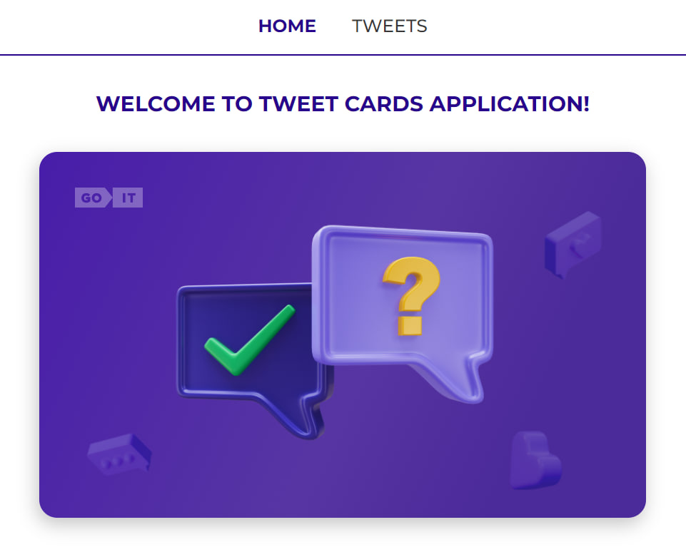
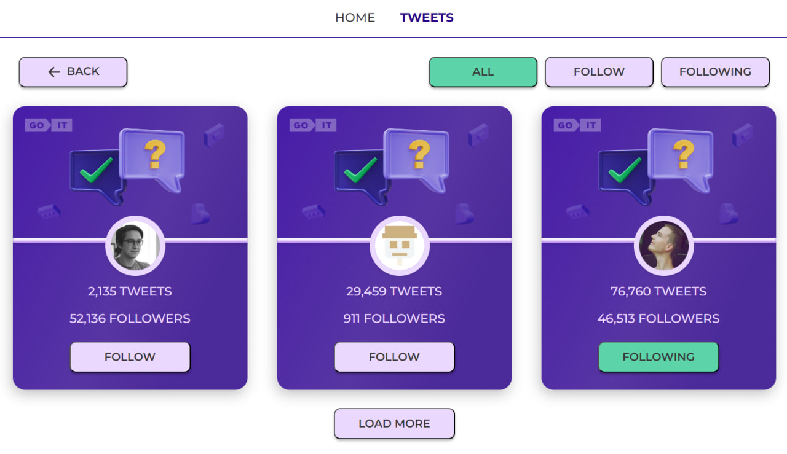
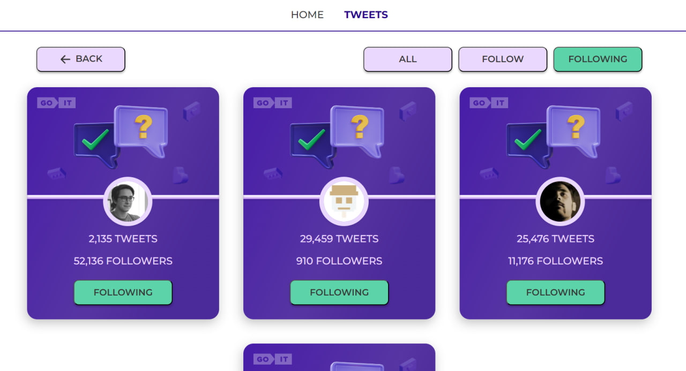
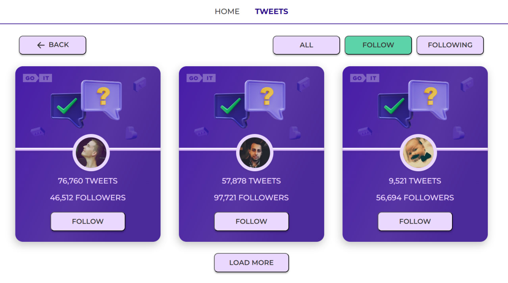

## Test-task-tweet-cards

This project was bootstrapped with
[Create React App](https://github.com/facebook/create-react-app).

This project using the Axios library and routing that allows you to navigate
between pages. It is designed to view a list of tweets with the ability to
filter by the user's subscription status.

Each item in the list is presented as a card that includes an avatar, number of
tweets and followers, and a subscribe/unsubscribe button.

The project allows you to download more cards with a single click of a button "LOAD MORE".

In general, the project provides a convenient interface for viewing cards with
the ability to filter and manage subscriptions.

  
  
  
  

